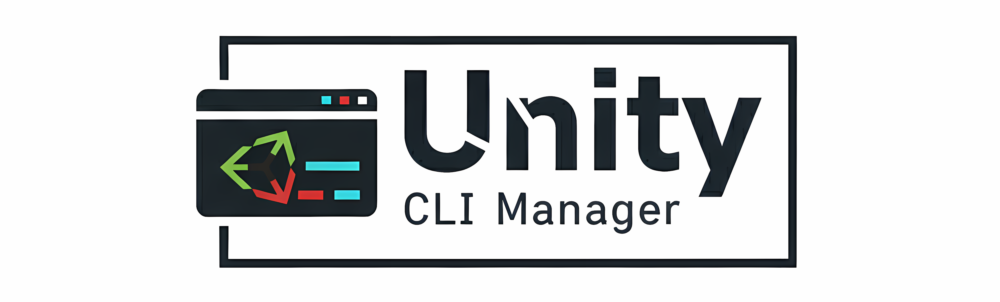

<div align="center">



<h1>Unity CLI Manager</h1>

<p>A command-line interface for managing Unity projects efficiently</p>

[](https://github.com/yourusername/unity-cli-manager)
[](LICENSE)
[](https://github.com/yourusername/unity-cli-manager)

</div>

<br>

## Overview

Unity CLI Manager brings Unity project management to your terminal. Create, build, and organize projects with simple commands built for developers who value speed and efficiency.

<br>

## Features

- **Project Management** - Create, open, list, and delete Unity projects
- **Multi-Platform Builds** - Build for Linux, Windows, and macOS
- **Project Templates** - Support for both 2D and 3D templates
- **Color-Coded Output** - Clear visual feedback
- **Safety Features** - Confirmation prompts for destructive operations

<br>

## Installation

### Requirements

- Unity Editor installed on your system
- Bash shell (Linux, macOS, or Windows via WSL)

### Setup

**Step 1: Download**

```bash
git clone https://github.com/yourusername/unity-cli-manager.git
cd unity-cli-manager
```

**Step 2: Make Executable**

```bash
chmod +x unity-cli.sh
```

**Step 3: Configure Paths**

Edit `unity-cli.sh` and set your paths:

```bash
UNITY_PATH="$HOME/Flow/Unity/Editor/Unity"      # Path to Unity Editor
PROJECTS_DIR="$HOME/MyProjects"                 # Projects directory
```

**Step 4: Create Alias**

Add to your `~/.bashrc` or `~/.zshrc`:

```bash
alias unity='/absolute/path/to/unity-cli.sh'
```

Then reload:

```bash
source ~/.bashrc  # or source ~/.zshrc
```

**Step 5: Verify**

```bash
unity version
```

<br>

## Commands

### Create Project

```bash
unity new <ProjectName> <2d|3d>
```

Creates a new Unity project. Project names must not contain spaces.

**Examples:**
```bash
unity new SpaceShooter 3d
unity new PlatformerGame 2d
```

---

### Open Project

```bash
unity open <ProjectName>
```

Launches Unity Editor with the specified project.

---

### Build Project

```bash
unity build <ProjectName> [platform]
```

Builds your project for the target platform. Defaults to Linux if no platform specified.

**Platforms:** `linux64` `windows` `mac`

**Examples:**
```bash
unity build SpaceShooter
unity build SpaceShooter windows
unity build PlatformerGame mac
```

**Build Output:**
```
ProjectName/
  Builds/
    Linux/
      ProjectName.x86_64
    Windows/
      ProjectName.exe
    Mac/
      ProjectName.app
```

---

### List Projects

```bash
unity list
```

**Alias:** `unity ls`

Displays all Unity projects in your directory.

---

### Project Information

```bash
unity info <ProjectName>
```

Shows detailed information about a project including Unity version and size.

---

### Delete Project

```bash
unity delete <ProjectName>
```

**Alias:** `unity rm`

Permanently removes a project directory.

> [!WARNING]
> Deletion is permanent and irreversible.

---

### Version & Help

```bash
unity version    # Show version and configuration
unity help       # Show all commands
```

<br>

## Quick Examples

```bash
# Create and open a new game
unity new MyGame 3d
unity open MyGame

# Build for multiple platforms
unity build MyGame linux64
unity build MyGame windows
unity build MyGame mac

# Manage projects
unity list
unity info MyGame
unity delete OldProject
```

<br>

## License

This project is licensed under the GNU General Public License v3.0. See the LICENSE file for details.

<br>

## Contributing

Contributions are welcome. Fork the repository and submit pull requests for improvements.

<br>
<br>

<div align="center">

**Built for developers who live in the terminal**

    <p><i>Made with focus by <a href="https://github.com/saeeedhany">saeeedhany</a></i></p>

</div>
